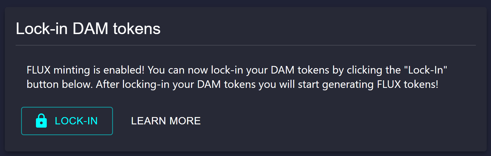
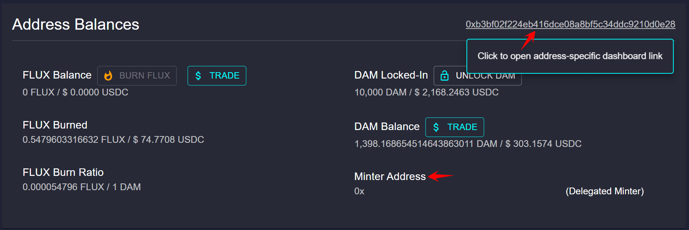

Delegated minting permits you to select another Ethereum wallet address to Mint your FLUX tokens.

This allows you to keep DAM tokens offline in cold storage while using a web-based wallet to mint your FLUX tokens.  

You can choose any delegated address that will recognize FLUX token and is compatible with MetaMask. For example, you can start a validator give your friend permission to mint your FLUX balance directly to their Ethereum address.

# Step 1.

Click Start Validator.

# Step 2. 
At the next screen, enter the total DAM tokens you would like to start your validator with. Then select the following Minting Address option:

**"I want another address to mint FLUX on my behalf (Delegated Minter)"**

Be sure to enter the Ethereum address that will mint your FLUX (e.g. your friend's Ethereum address). 

# Step 3. 
Confirm the transaction in your MetaMask account. 

# Step 4. 
Depending on your network Gas fee, you will see your transaction change from Pending --> Confirmed after several seconds or a few minutes.

# Step 5. 
Go to the **Address Balances** section of your Dashboard. 
If you hover your mouse **over your address in the top right corner**, your address-specific dashboard URL will be displayed. Notice in the lower right-hand corner you can also see the Minter Address. 

Here is a closer look at the **address-specific dashboard link (URL)**.

In order to mint FLUX using a Minter Address, it is important that you know your address-specific dashboard URL.
Visiting your dashboard-specific URL from a Minter Address MetaMask account will allow you to mint FLUX on behalf of your original mint address.

**In Summary:**
1) Datamine mint can be started inside "address A" while "address B" is specified as the delegated minter. 
2) Visit the "address A" dashboard-specific URL from "address B" to MINT FLUX.

**My "MINT" Button is greyed out with the following tooltip: "Select the Delegated Minter Address account in your wallet to mint for this address."**

AddressA = Started Mint

AddressB = Delegated Minter

- Make sure the URL is: **Followed by AddressA**
- Make sure AddressB is selected in Metamask