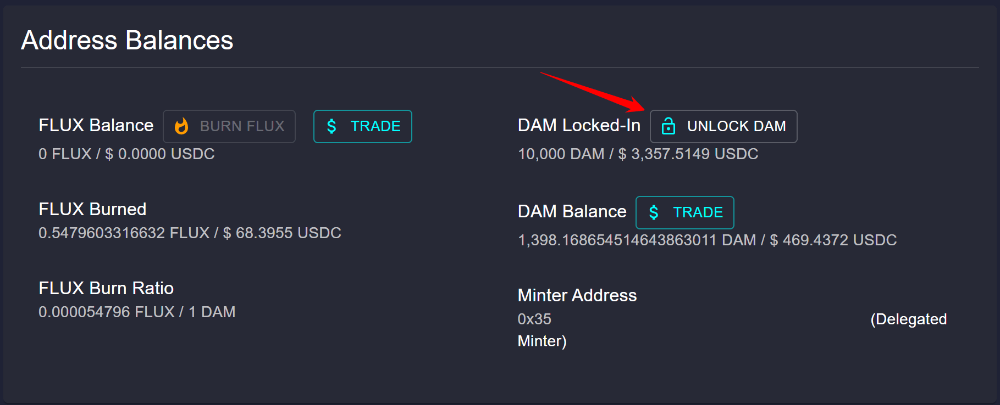

# 📈 How to Grow Your Validator (Add more tokens)

This guide explains how to increase the amount of tokens (DAM, FLUX, ArbiFLUX, or LOCK) locked in your validator across all supported ecosystems. This process involves stopping your current validator and then restarting it with an increased amount of tokens.

**Please note**: stopping your validator will cause you to lose your current time bonus. Any **unminted** FLUX/ArbiFLUX/LOCK tokens will also be lost. We recommend that you **mint** your FLUX/ArbiFLUX/LOCK tokens **before stopping your validator**.

## Step 1: Stop Your Existing Mint
To increase your validator size, you have to **stop your existing mint first**. This is done to prevent various exploits and to discourage accessing cold storage balance. 
You will find the STOP MINT button in your Dashboard Section: Address Balances.

## Step 2:
After pressing STOP MINT, you will see the following confirmation screen:

## Step 3:
Press Continue. Then use your MetaMask account to confirm the transaction.

## Step 4:
Congratulations! You have successfully stopped your validator. You can now re-start your validator with more tokens.