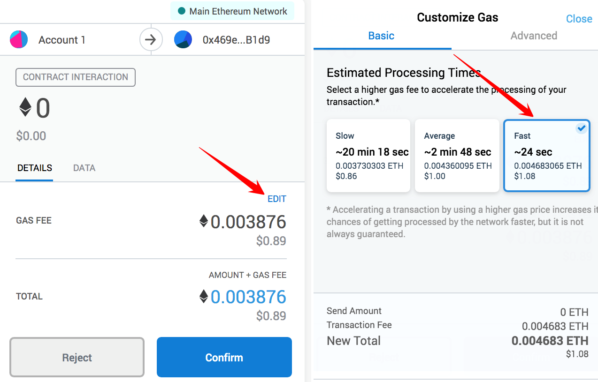

GAS fees allow you to process and validate transactions on the Ethereum blockchain. You need to pay a GAS fee to confirm your Datamine transactions. 

Datamine's Ethereum-based smart contracts have actions such as: locking, minting, burning, all of which require GAS. We recommend setting your GAS Fee to **Fast** so that your transaction processes quickly.

You can access your MetaMask extension through your browser:

When you are ready to confirm your transaction, click the EDIT button under GAS FEE.
Select Fast (this will slightly increase your transaction fee but also result in a faster transaction).

After pressing confirm, your transaction will now be PENDING. Confirmation may take anywhere from several seconds up to a few minutes.

You also have the ability to speed up your transaction by viewing the transaction details and adding some GAS. 
If you have pending transactions that you cannot speed up due to low gas fees, you need to wait for them to confirm. 

If your GAS fee was too low or the transaction data was corrupted, you will see the following message. We recommend refreshing your browser and then resubmitting your transaction. 

Congratulations! You can now adjust your GAS fee in MetaMask and check the status of your transaction. 