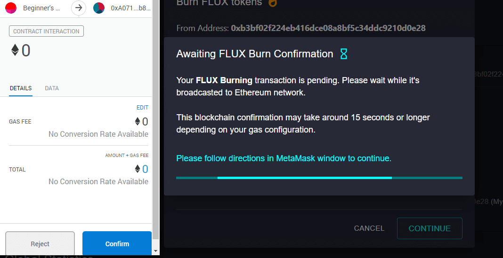

Burning FLUX increases burn mutliplier **at time of minting FLUX**. Your validator can receive up FLUX tokens up to 10x faster by burning 9x the global burned average. The number of FLUX required to burn to get to these multipliers is available on our dashboard.

Minting and burning are smart contract actions that incur a small gas fee. If your wallet contains FLUX tokens, you will see the "BURN FLUX" button. 

When confirming your transaction in MetaMask, we recommend setting the GAS FEE to "Fast" to ensure your transaction processes quickly.

# Step 1
Click "BURN FLUX"

# Step 2
Enter the quantity of ArbiFLUX tokens you would like to burn.

(Your burn bonus will update after your burn transaction confirms).

# Step 3
Please follow directions in MetaMask window to continue. **Remember to set GAS FEE to fast.**

**Congratulations, you have successfully increased your burn multiplier!**

**The amount of FLUX burned is PERMANENT and stays associated with your Ehtereum address FOREVER.** That means stopping your validator will not reset your FLUX burned amount.