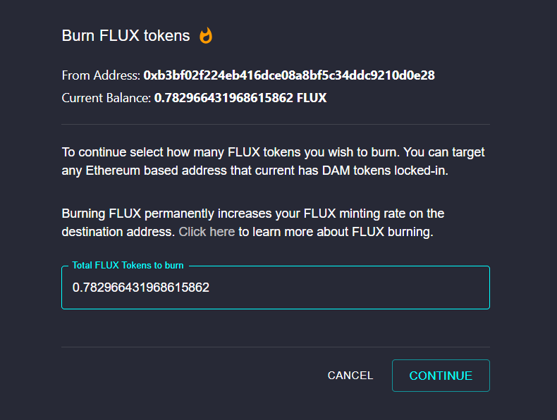

Burning FLUX increases burn mutliplier **at time of minting FLUX**. You can receive up to 10x more FLUX tokens by burning 9x the global burned average. The number of FLUX required to burn to get to these multipliers is available on our dashboard.

Minting and burning are smart contract actions that incur a small gas fee. After minting your FLUX balance, you will see the "Burn Flux" feature. 
When confirming your transaction in MetaMask, we recommend setting the GAS FEE to "Fast" to ensure your transaction processes quickly.

# Step 1
Click "BURN FLUX"

# Step 2
Enter the quantity of FLUX Token Dividends you would like to burn.
(Your burn bonus will update after your Burn FLUX tokens). Minting Bonuses Explained

# Step 3
Please follow directions in MetaMask window to continue. **Remember to set GAS FEE to fast.**

**Congratulations, you have successfully re-invested your Dividends by burning FLUX Tokens!**

**The amount of FLUX burned is PERMANENT and stays associated with your Ehtereum address FOREVER.** That means unlocking your Datamine (DAM) tokens will not reset your FLUX burned amount.