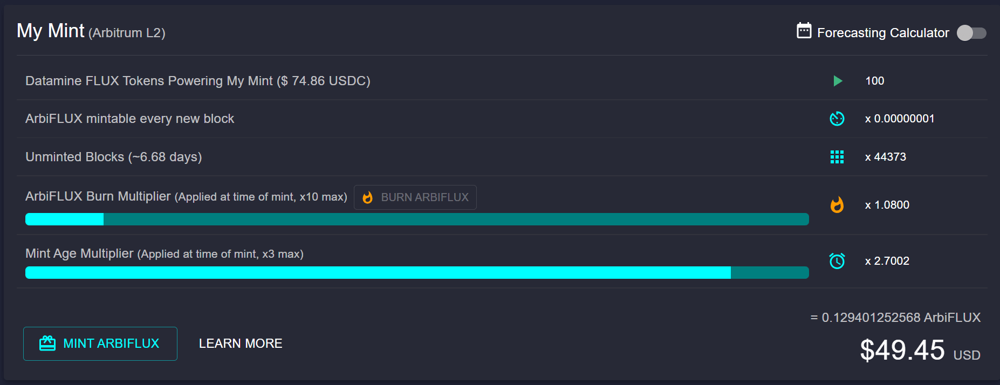

```
To mint ArbiFLUX tokens you must first start a validator with your FLUX (L2) tokens.
```

# Step 1

Now that your validator is started you will instantly start generating FLUX tokens of **0.00000001 ArbiFLUX per 1 FLUX (L2) in mint** ~ every 15 seconds with each block. This means that your ArbiFLUX token balance automatically increases with each block in realtime in your dashboard.

You will see a realtime Unminted ArbiFLUX USD Balance: an estimate of how much your ArbiFLUX tokens are worth based on real, on-chain USD multi-route Uniswap data. While these ArbiFLUX tokens are unminted they exist in the smart contract, not your MetaMask account.



In order to receive your ArbiFLUX tokens from your validator, you need to press "MINT ARBIFLUX".

The most efficient way to mint tokens at any time is:
1. Get 3x time bonus (28 days after starting a validator). 
2. Before pressing mint, make sure you have 10x burn multiplier, if not buy ArbiFLUX and burn.

Bonuses are calculated at the time of minting ArbiFLUX tokens.

# Step 2
To continue, please specify an address where you want to mint these ArbiFLUX tokens. You can specify any Ethereum-based address.


# Step 3
Please follow directions in MetaMask window to finalize your validator (this action requires a small gas fee)


# Step 4
Congratulations, you have successfully minted your ArbiFLUX tokens.