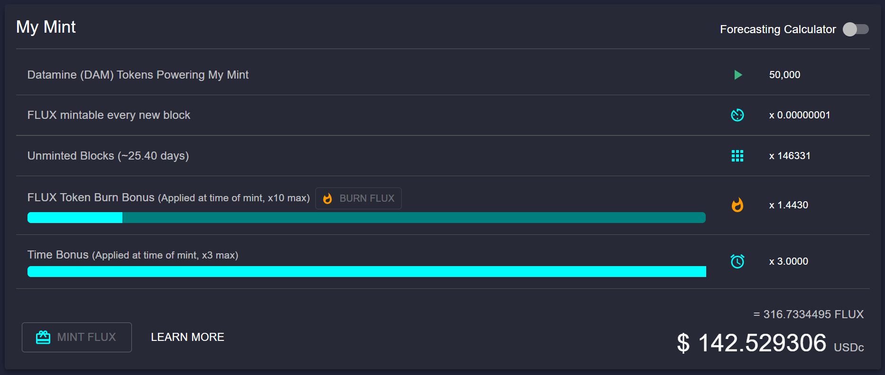
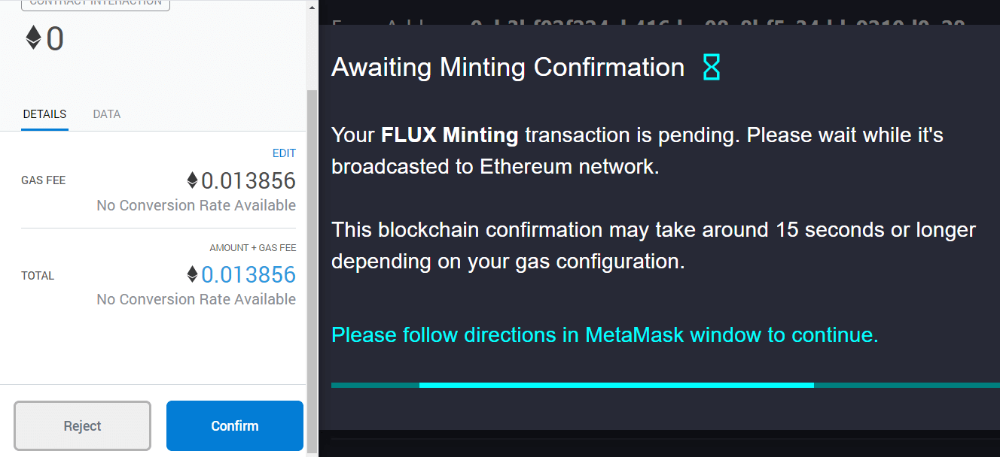
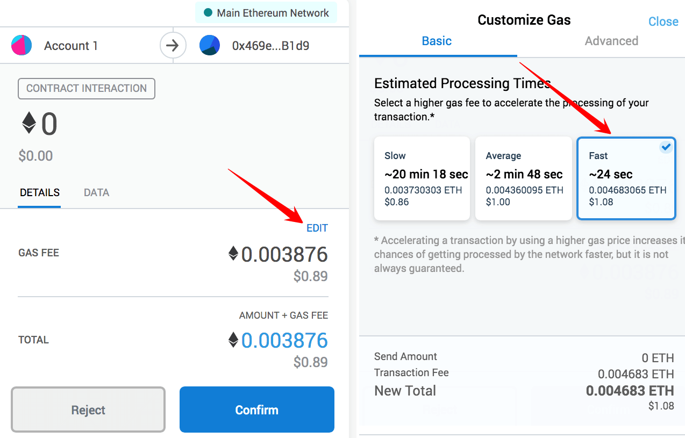

```
To mint FLUX tokens you must first start a validator with your Datamine (DAM) tokens.
```

# Step 1

Now that your validator is started you will instantly start generating FLUX tokens of **0.00000001 FLUX per 1 DAM in validator** ~ every 15 seconds with each block. This means that your FLUX token balance automatically increases with each block in realtime in your dashboard.

You will see a realtime Unminted FLUX USD Balance: an estimate of how much your $FLUX tokens are worth based on real, on-chain USD multi-route Uniswap data. While these FLUX tokens are unminted they exist in the smart contract, not your MetaMask account.



In order to receive your FLUX tokens from your validator, you need to press "MINT FLUX".

The most efficient way to mint tokens at any time is:

1. Get 3x time bonus (28 days after starting a validator). 
2. Before pressing mint, make sure you have 10x burn multiplier, if not buy FLUX and burn.

Bonuses are calculated at the time of minting FLUX tokens.

# Step 2
To continue, please specify an address where you want to mint these FLUX tokens. You can specify any Ethereum-based address.


# Step 3
Please follow directions in MetaMask window to finalize your validator (this action requires a small gas fee - we recommend setting the GAS FEE to FAST to ensure your transaction completes quickly)




# Step 4
Congratulations, you have successfully minted your FLUX tokens.