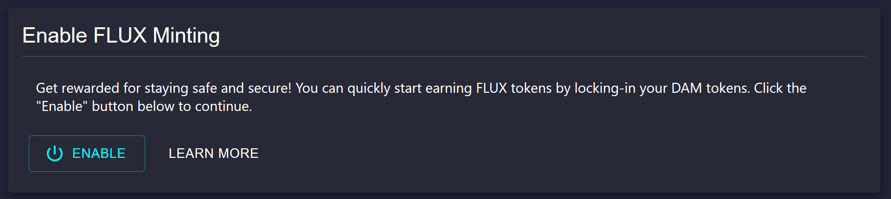
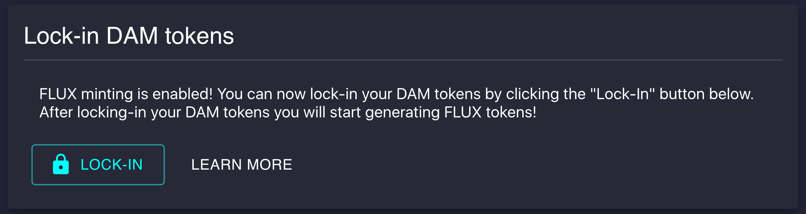

```
To continue, your MetaMask wallets needs to have DAM and ETH.
```

# Authorizing FLUX Smart Contract

In order to start your validator, you need to authorize the Datamine smart contract to interact with your Ethereum wallet (which costs a small gas fee). This option will only be available after you have connected your MetaMask wallet to Datamine ecosystem



By pressing Enable, Datamine checks your DAM and ETH balances before allowing you to start your validator. Every transaction or smart contract in Ethereum requires gas. Starting a validator is done via a smart contract. If you do not have Ethereum to pay a small gas fee, you will be unable to start your validator. Therefore, we recommend that you have a starting balance of ~$200 in Ethereum on L1. 


# Starting Datamine Validator

## Step 1

You can now begin by clicking the "Start Validator" button. After paying a small gas fee for starting your validator, you will instantly start generating FLUX tokens in your dashboard (**with every single block ~ 15 seconds, you generate of 0.00000001 FLUX per 1 DAM in validator**)



## Step 2

To continue, enter how many DAM tokens you wish to use for your validator. You can stop your validator to get 100% of DAM tokens back at any time.


## Step 3

You can Mint FLUX to your MetaMask address OR you can mint to ANOTHER delegated minting address (e.g. your friend's wallet). Unless you want to Mint to another address, we recommend selecting "I want to mint my own FLUX tokens."

Please follow directions in MetaMask window to confirm the mint starting transaction. We recommend selecting GAS FEE to FAST to ensure your transactions process quickly. You can select Fast after pressing "EDIT" under Gas Fee.


Allow transaction to confirm.

Congratulations, your validator is now started! You are now generating FLUX tokens. You can stop your validator at any time to get 100% of your DAM tokens back.

**Stopping a validator will cause you to lose your current time bonus. Any unminted FLUX tokens will also be lost. We recommend that you mint your FLUX tokens before stopping a validator.**