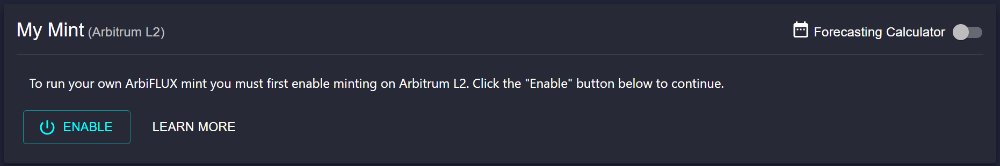
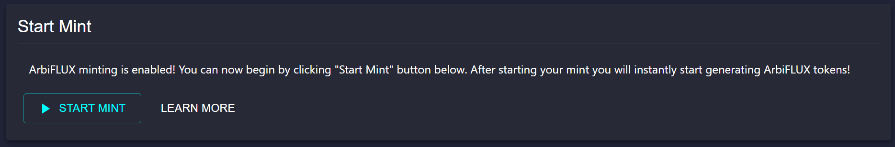

# Connecting To Arbitrum L2

To continue, your MetaMask wallets needs to have FLUX (L2) and ETH on Arbitrum L2. Please note you will need to be connected to Arbitrum L2 network to proceed.

If you only have assets on Mainnet (L1) you must bridget them to L2 using the official Arbitrum Bridge: [bridge.arbitrum.io](https://bridge.arbitrum.io/)

# Authorizing ArbiFLUX Smart Contract

In order to start your L2 mint, you need to authorize the ArbiFLUX minting smart contract to interact with your Ethereum wallet (which costs a small gas fee on Arbitrum). This option will only be available after you have connected your MetaMask wallet to Datamine ecosystem. 

By pressing Enable, Datamine checks your FLUX (L2) and ETH balances before allowing you to start your validator. Every transaction or smart contract in Ethereum requires gas. Starting a validator is done via a smart contract. If you do not have Ethereum on L2 to pay a small gas fee, you will be unable to start your validator. Therefore, we recommend that you have a starting balance of ~$20 in Ethereum on Arbitrum L2. 

# Starting Datamine Validator

## Step 1

You can now begin by clicking the "Start Validator" button. After paying a small gas fee for starting your validator, you will instantly start generating ArbiFLUX tokens in your dashboard (**with every single block ~ 15 seconds, you generate of 0.00000001 ArbiFLUX per 1 FLUX (L2) in mint**)

## Step 2

To continue, enter how many FLUX (L2) tokens you wish to use for your validator. You can stop your validator to get 100% of FLUX (L2) tokens back at any time.

## Step 3

You can Mint ArbiFLUX to your MetaMask address OR you can mint to ANOTHER delegated minting address (e.g. your friend's wallet). Unless you want to Mint to another address, we recommend selecting "I want to mint my own ArbiFLUX tokens."

Please follow directions in MetaMask window to confirm the mint starting transaction. Minting on Arbitrum will confirm within 5 seconds. We recommend you proceed with Metamask suggested gas fees if they are acceptable.

Allow transaction to confirm (this should be done within 5 seconds on L2).

Congratulations, your validator is now started! You are now generating ArbiFLUX tokens. You can stop your validator at any time to get 100% of your FLUX (L2) tokens back.

**Stopping a validator will cause you to lose your current time bonus. Any unminted ArbiFLUX tokens will also be lost. We recommend that you mint your ArbiFLUX tokens before stopping a validator.**