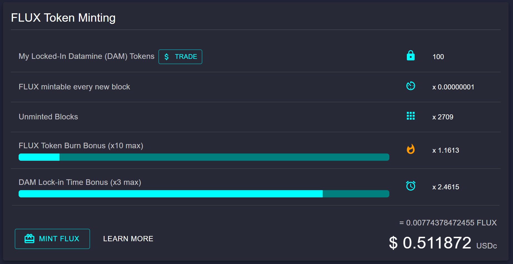
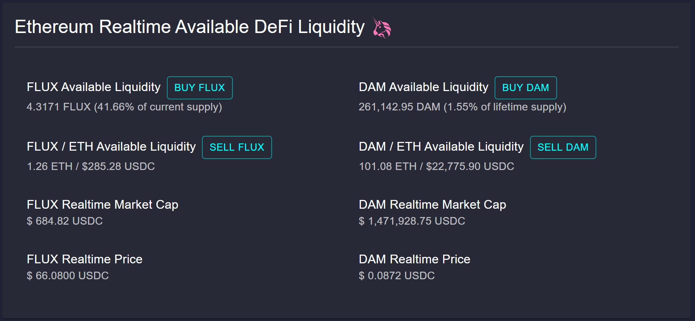
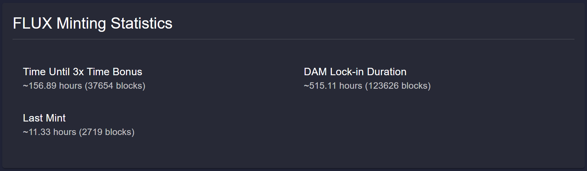
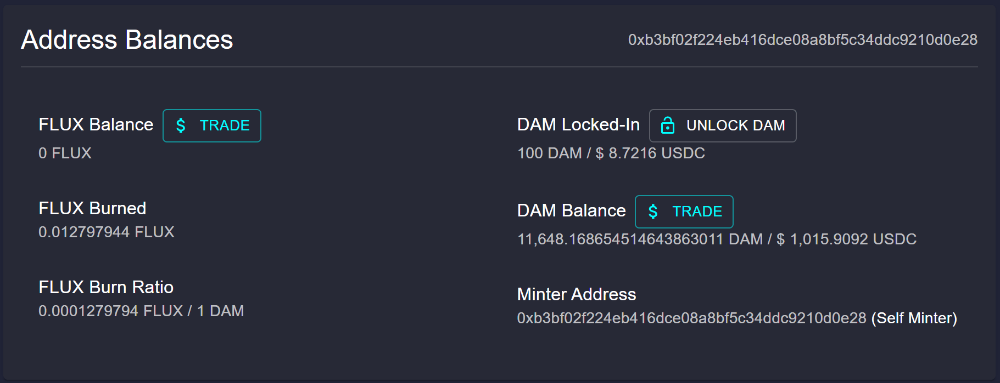
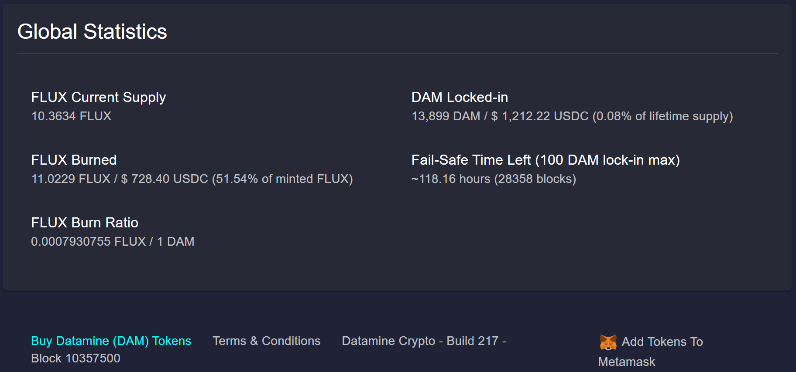

[The Datamine Dashboard](https://datamine-crypto.github.io/realtime-decentralized-dashboard/) is a feature-rich user interface and all-in-one realtime powerhouse of data. Get all your $DAM, $FLUX, $ETH, & $USD analytics points from on-chain data in a single place instantly. The dashboard is where you can start your validator and produce/destroy FLUX tokens.

### 💡 Watch your $FLUX USD balance increase on real-time, on-chain USD multi-route Uniswap data.
We've taken all the complications and calculations away. See your unminted FLUX tokens balance in realtime based on all your bonuses.

### 💡 Ethereum / DAM / FLUX Realtime Available DeFi Liquidity
You can see Uniswap liquidity data in realtime right from Datamine Dashboard! Calculate how much decentralized liquidity is available without use of exchanges. By interacting directly with the Uniswap smart contract, we're able to provide you with realtime market data. This multi-smart communication is a foundation of our dashboard and fits in perfectly with the other DAM/FLUX realtime data points. 

### 💡 Realtime USD/ETH pricing for Datamine (DAM) & FLUX tokens
Using our multi-smart contract mesh, we're able to fetch USD price and compute DAM & FLUX market cap in realtime! 

### 💡 User-specific minting statistics 
This is where you can check when you last Minted FLUX tokens. Easily calculate the duration of time you need to for your validator to reach your 3x Time Bonus.

### 💡 Realtime portfolio valuation of your validator and FLUX address balances in USD
Here you can check your FLUX balance with ease and calculate how much FLUX you have burned. You will also appreciate the displayed value of your validator size in USD.

### 💡 Global value of active mints in USD.
Visit this section to verify the current FLUX supply and determine what percentage of minted FLUX has been burned globally. Here you will also see the global value of active mints in USD.

