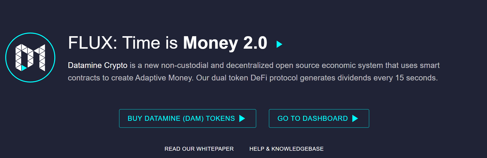
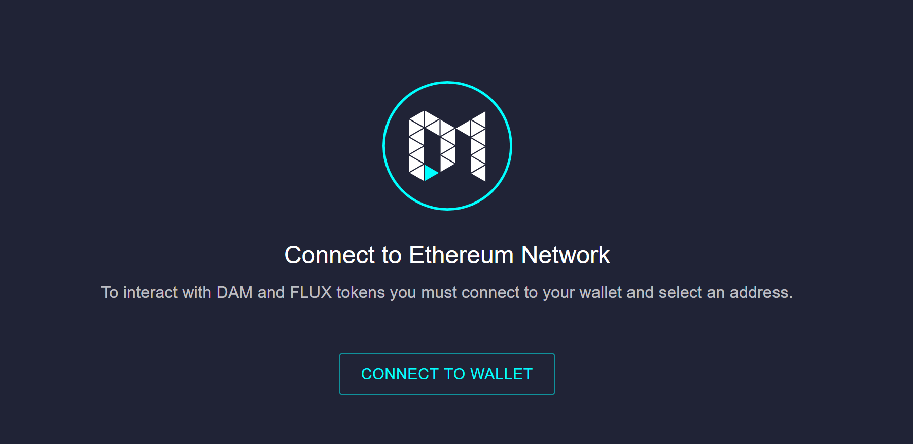
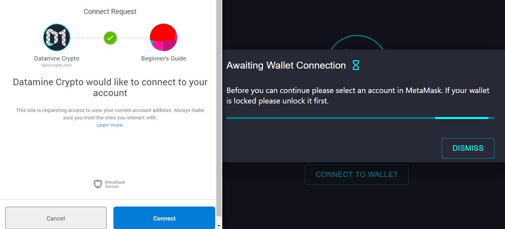

Our smart contracts are fully open source. Datamine website is a decentralized gateway into the Datamine Ecosystem. The smart contracts on our dApp DO NOT touch your Ethereum balance and only interact with our DAM/FLUX tokens.

Please ensure that you have installed and are logged into MetaMask before following the steps below.

# Step 1
Visit [https://datamine-crypto.github.io/realtime-decentralized-dashboard/](https://datamine-crypto.github.io/realtime-decentralized-dashboard/) (Decentralized build of Datamine dApp). Click on ["Validator Dashboard"](https://datamine-crypto.github.io/realtime-decentralized-dashboard/#dashboard)

# Step 2
Next, connect your wallet to the Datamine platform by clicking "Connect to Wallet"

# Step 3
Next, allow Datamine to interact with your MetaMask wallet by clicking "Connect"

# Step 4
Congratulations, you are now ready to use the Datamine Ecosystem.