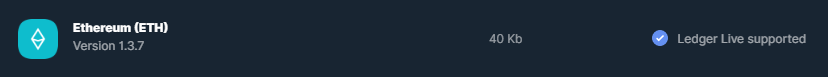
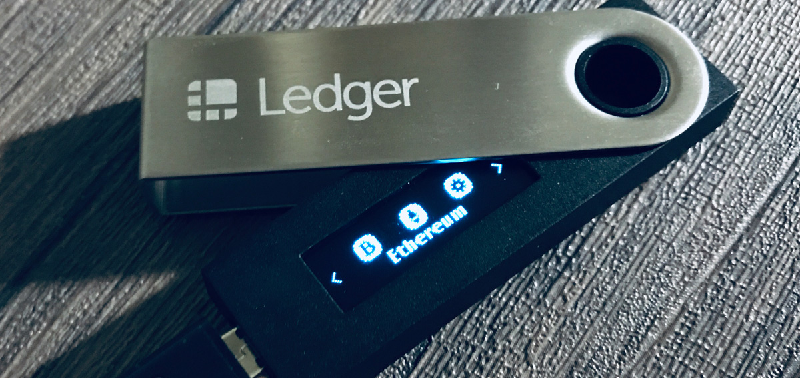
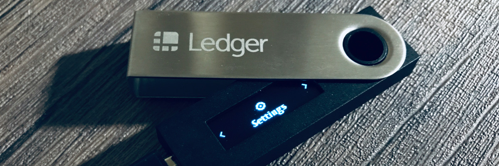
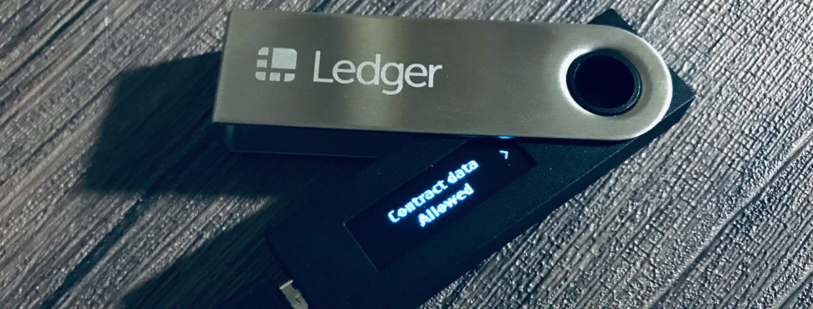

After reading this guide, you will know how to securely store DAM tokens on your Ledger device. You must own a Ledger Hardware Wallet and have MetaMask installed before starting.

**Step 1**: Download the official Ledger Live application from: [www.ledger.com/ledger-live/download/](https://www.ledger.com/ledger-live/download/)

**Step 2**:** If you have not set up your Ledger device, see the video below. Otherwise go to step 3. 

**Step 3**: Install the **Ethereum app** on your Ledger hardware wallet to manage Ethereum (ETH) with Ledger Live.

1. Open the Manager in Ledger Live:

2. Connect and unlock your device:

3. Allow the Ledger Manager on your device:

4. Find **Ethereum** in the app catalog using the Ledger Live software. Click the Install button of the app. Your device will display Processing... The app will then be installed. Now it's time to use the actual device.

**Step 4**: Enable contract data (so that you can interact with smart contracts).

1. Select the Ethereum Application on your Ledger Device. 

2. Within the Ethereum application, open settings. 

3. Select "Contract Data Allowed"

4. You may now exit out of the Ethereum application. 

**Step 5**: Connecting Ledger to MetaMask.

Before starting, make sure that you have the most up-to-date firmware on your Ledger device (firmware version 1.6) and the most up-to-date Ethereum App on the Ledger (from Ledger Live > Manager). 

1. Close the Ledger Live application.
2. Leave your Ledger device connected to your computer.
3. Open your MetaMask wallet. Go to your accounts. Press "Connect Hardware Wallet"

4. Next, select Ledger. Then press connect. **Reminder**: your Ledger device needs to be on, pin-code unlocked & connected to your computer before connecting. 

5. You may see the following screen. Authorize the connection directly from your Ledger device.

6. Next, import one of your Ledger Ethereum Addresses into MetaMask. 

7. You have now successfully imported your Ledger ETH (Hardware) address into your MetaMask wallet! You can safely store DAM on this Ethereum address.

**Please note**: you need to manually authorize withdrawals and approve any smart-contract actions directly from your Ledger Device (you will see the pending transaction awaiting your approval on the Ledger device). This is a security measure designed to prevent anyone from using your DAM balance if your MetaMask wallet is compromised. 