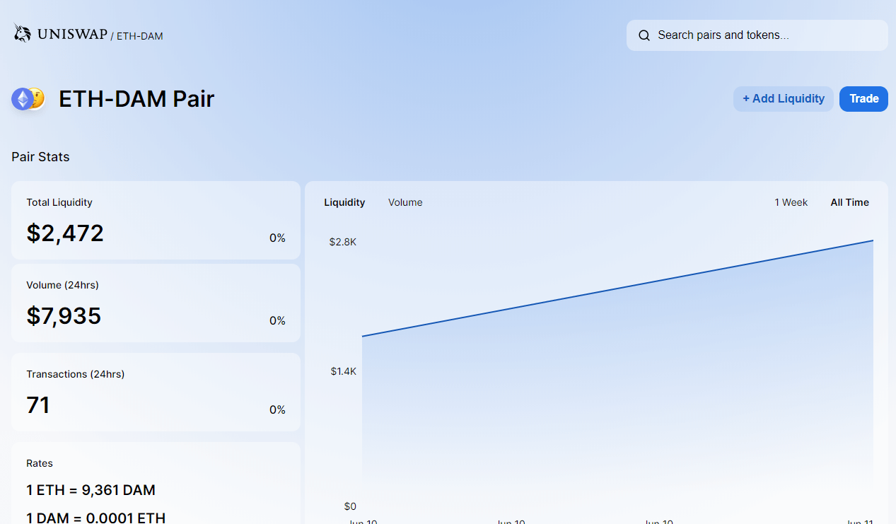
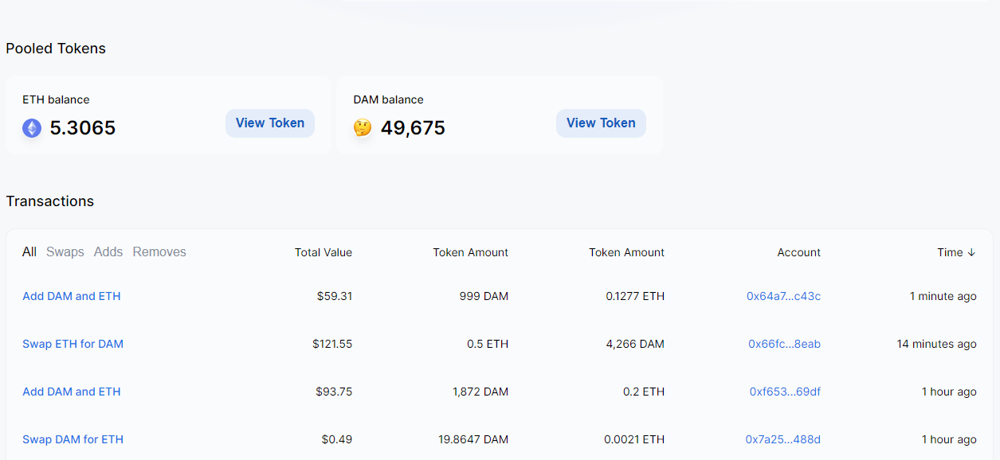
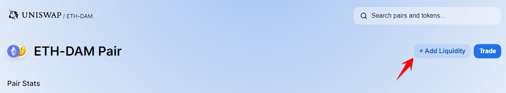

You'll find some very helpful information on this page. You will see the **Pooled Tokens** feature. In the screen shot above, there are 5.3065 ETH and 49,675 DAM tokens in the ETH-DAM liquidity pool. You can think of a liquidity pool as tokens that sit on the exchange. These tokens are deposited by individuals who become liquidity providers (a person who deposits equivalent amounts of ETH and DAM to Uniswap) in order to allow other users to trade the token. 

Liquidity providers receive a fee from users who conduct swaps. 

The Uniswap platform charges a 1.00% flat fee when users trade (aka swap) ERC 20 tokens. Liquidity providers get a proportional share of these transaction fees based on the amount of liquidity provided. Fees are distributed among liquidity providers proportional to their contribution. They can be collected at any time, but are automatically reused in the liquidity pools until they are collected. You will earn a bit of DAM and ETH per swap transaction. 

When somebody wants to trade DAM to Ethereum on Uniswap, your liquidity token is used. So, your balance may shift more towards Ethereum, or it may shift more towards DAM based on the trades. So, if somebody wants to sell DAM and take Ethereum out, your Ethereum liquidity might shrink, and your DAM liquidity might go up. It is a dynamic process.

**If I provide liquidity, can one of my assets to disappear entirely?**

In short, no. You supply your pair (in this case DAM/ETH). As an example, let's say you deposit 1 ETH and 1 DAM. You receive 1 **liquidity token** for the ETH/DAM pool. **People trade with the pool, not your tokens directly**. Your 1 liquidity token allows you to _withdraw a ratio_ of ETH and DAM in the future.

This ratio starts at 1:1, but changes with the market. For example, if more people are buying DAM in exchange for ETH, you could end up with 1.5 ETH and 0.5 DAM. If purchasing continues, you could end up with 3 ETH and 0.1 DAM, for example. And you'd still benefit from collecting the swap fees.

For a more technical explanation, we recommend reading: [A Graphical Guide for Understanding Uniswap](https://docs.ethhub.io/guides/graphical-guide-for-understanding-uniswap/)

# Step 1

Let's try adding Liquidity to the ETH-DAM Pair. **Click: + Add Liquidity**

(Note, this step is _optional_). If you want to learn about swapping tokens instead, **skip to step 12**.

# Step 2

In order to Add Liquidity, you need to have ETH AND DAM in your wallet. You cannot add liquidity if you only have DAM without ETH or ETH without DAM. 

You can quickly figure out how much DAM or ETH you can add by clicking the MAX button. For a certain DAM amount, the equivalent ETH will be calculated based on current market price. Conversely, the same holds true for ETH. For a certain amount of ETH, you will be required to deposit an equivalent monetary value of DAM token based on the market price.

If you press the Max button for DAM, you may find that you don't have enough to add to the liquidity pool. This is okay. Just press the Max button for ETH instead, or enter your own custom values. 

# Step 3

Confirming Liquidity. In this example, we've added 495 DAM and 0.053 ETH to the ETH-DAM Uniswap Liquidity pool. In order to confirm your transaction, you will need to follow the instructions in MetaMask. 

Your transaction will be submitted after confirming the transaction on MetaMask.

Initially pending, then confirmed. 

You can then see your pooled Liquidity by visiting: [uniswap.exchange/pool](https://uniswap.exchange/pool)

You can add or remove your pooled ETH/DAM token(s) anytime you wish. Congratulations, you are now a **Uniswap liquidity provider**, and will **passively earn exchange fees (1.00%)** for every single swap transaction that involves DAM. How cool is that. For more information on becoming a liquidity provider, see Step 8. 

# Step 4

Swapping DAM token. Be sure you are on: [uniswap.exchange/swap](https://uniswap.exchange/swap)

You can use this menu to swap DAM into ANY ERC-20 token. You can also swap ANY ERC-20 token into DAM. Cool, right? The calculation is based on the current market price and uses the following input: 1 ETH = quantity of DAM. 

