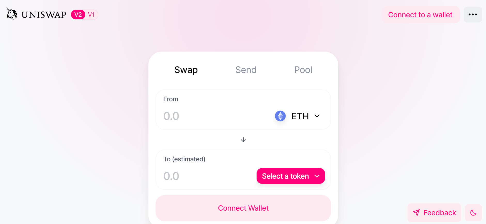
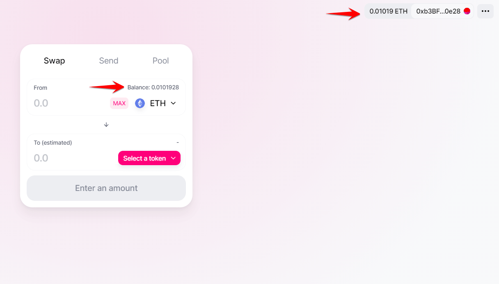
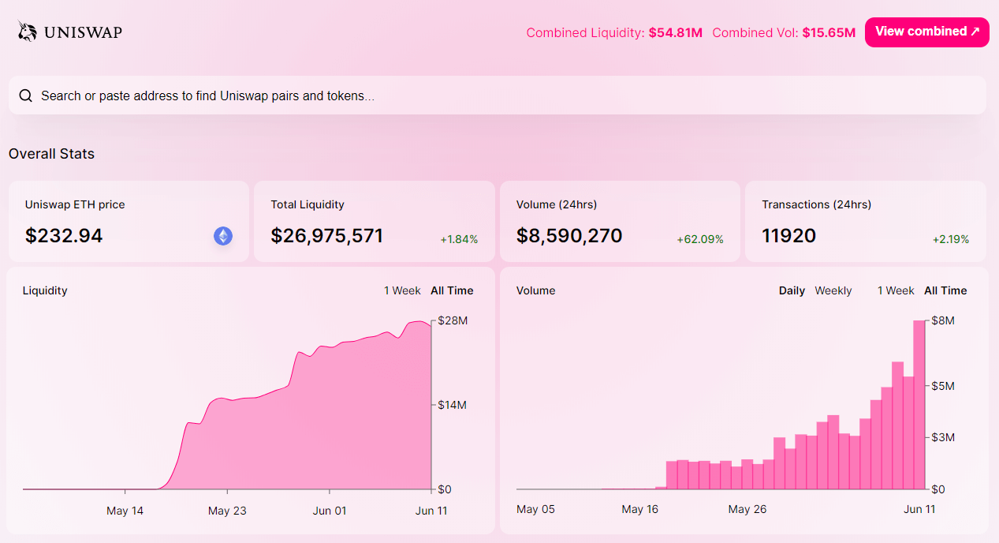
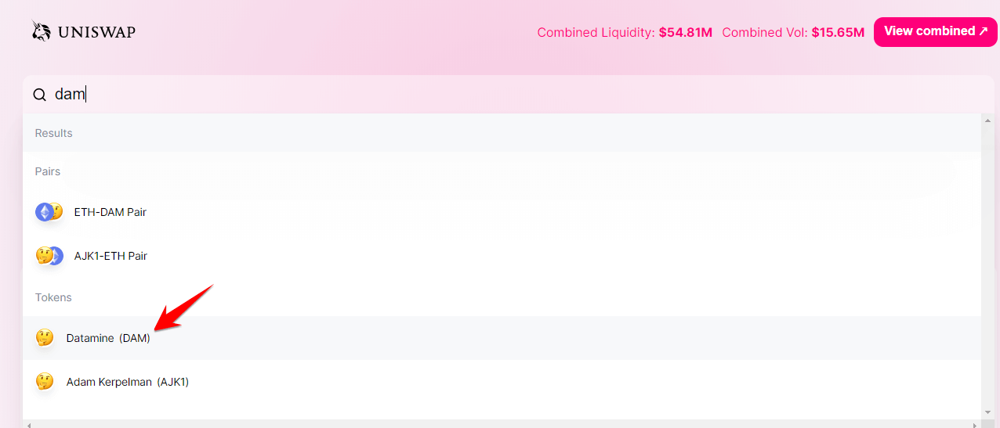
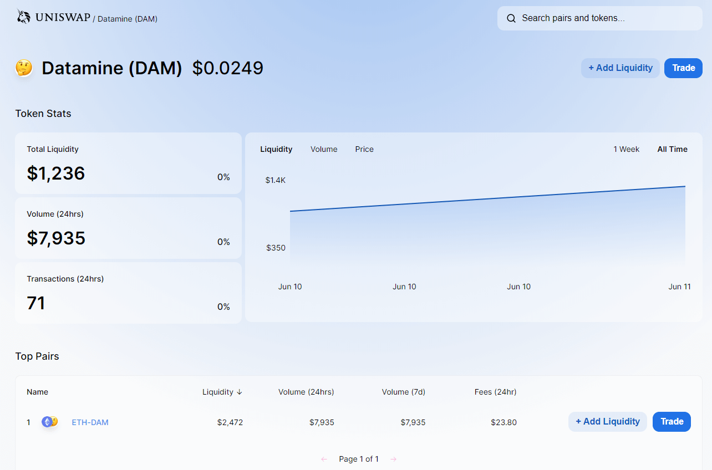
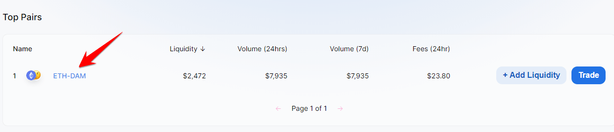

You can now exchange DAM into ETH or any other ERC-20 token! Uniswap is a simple, smart contract interface for swapping ERC-20 tokens. It is an amazing decentralized tool fantastic for the Ethereum system and seamlessly integrates with Datamine token.

To follow this guide, you need to have MetaMask installed. See our guide on installing MetaMask.

# Step 1
To purchase Datamine (DAM) tokens with Uniswap, start by visiting: [app.uniswap.org](https://app.uniswap.org/#/swap?inputCurrency=eth&outputCurrency=0xF80D589b3Dbe130c270a69F1a69D050f268786Df)

# Step 2
In the top right-hand corner, click: Connect to wallet. 

# Step 3
You will have several wallets to choose from. We recommend that you use **MetaMask**. Select MetaMask.

# Step 4
After unlocking your MetaMask wallet, you will see the following screen. Press connect. **(If you have not connected to Uniswap before, you will be asked to authorize a small gas fee in order for Uniswap to interact with your MetaMask wallet)**. This is normal.

# Step 5
After unlocking your wallet, you will now see your updated ETH balance and ETH address on Uniswap.

# Step 6
Before attempting to swap DAM or earning trading fees by becoming a liquidity provider, let's take a step back and check out the DAM page on Uniswap. 

**Start by going to**: [info.uniswap.org](https://info.uniswap.org/pair/0x447f8d287120b66f39856ae5ceb01512a7a47444)

Here, you will see the exchange home page that contains total liquidity and 24 hour trading volume. Pretty neat. Remember, Uniswap is decentralized. This means peer-to-peer trading of cryptocurrencies with NO central authority.

# Step 7
Let's find DAM on Uniswap. In the search bar, type in: **DAM**. You will see the ETH-DAM Pair on your screen (skip for now), and a bit further down **Datamine (DAM). Click on Datamine (DAM). If you do not see Datamine, you may have to search for the token by using the smart contract address:** 0xF80D589b3Dbe130c270a69F1a69D050f268786Df

# Step 8
You were sent to: https://uniswap.info/token/0xf80d589b3dbe130c270a69f1a69d050f268786df 
This is the official URL for Datamine on Uniswap. Here you will see the DAM token price, total liquidity, with 24 hour trading volume and number of transactions. 
 

# Step 9
Now let's check out the ETH-DAM trade pair on the bottom of your screen.

You were sent to: [info.uniswap.org/pair/0x447...](https://info.uniswap.org/pair/0x447f8d287120b66f39856ae5ceb01512a7a47444)
This is the official pair-address, pairing DAM with ETH on Uniswap. You can verify it on the chain here: [etherscan.io/address/0x447...](https://etherscan.io/address/0x447f8d287120b66f39856ae5ceb01512a7a47444)